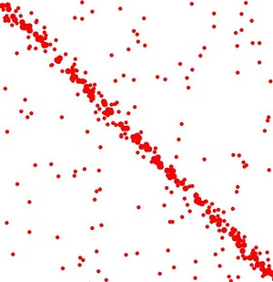
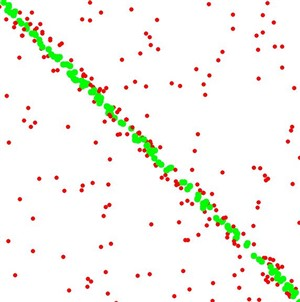

# RANSAC-2D
Basic 2D RANSAC implementation from scratch using C++ and OpenCV library


## Original Data   
  


## Output of RANSAC



## Dependencies
* OpenCV >= 4.3
  * The OpenCV 4.3.0 source code can be found [here](https://github.com/opencv/opencv/tree/4.3.0)


## Test
You can play number of inlier and outlier parameters for creating data
```
createData(int inlierNum,int outlierNum,int imageSize)
```
You can modify RANSAC parameters, distanceTolerance and maxIteration
```
executeRANSAC(std::vector<cv::Point> data, float distanceTolerance, int maxIteration)
```

If you want to change level of scattering  of points which be inlier, you can change Perturb parameter
```
int Perturb = 10;
```

